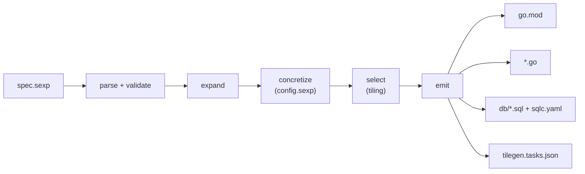

# tilegen

[](https://github.com/vinodhalaharvi/tilegen/actions/workflows/ci.yml)

Compile a small S-expression spec into Go scaffolding by successive lowering
passes and **tree tiling** - the instruction-selection technique compilers
use - then hand the remaining, precisely described holes to an LLM.

Deterministic structure (module, types, interfaces, signatures, wiring, SQL)
is compiled. Only method bodies are left open, each with a contract, an
intent, and constraints.



Every pass maps S-expressions to S-expressions. Run with `-dump` to see each
stage in `<out>/.tilegen/` - the same idea as `GOSSAFUNC` in the Go compiler.

## Quick start

```sh
go install github.com/vinodhalaharvi/tilegen@latest
tilegen -config examples/shop/config.sexp -out out/shop -dump examples/shop/spec.sexp
cd out/shop && go mod tidy && go build ./...   # compiles; bodies panic until filled
```

Or from a clone: `make demo`, `make dump`, `make help`.

## The spec

```lisp
(project shop
  (module github.com/acme/shop)
  (go 1.22)
  (require (uuid github.com/google/uuid v1.6.0))
  (package orders
    (entity Order
      (field ID uuid.UUID)
      (field PlacedAt time.Time)
      (store get list save delete
        (constraint "Save must be idempotent for the same ID.")))
    (interface Pricer
      (method Quote (params (o *Order)) (returns int64 error)))
    (llm "Write a Pricer that applies a 10% discount to orders over 100.00.")))
```

| Form | Meaning |
|---|---|
| `(module path)` `(go 1.22)` | go.mod basics, validated by `x/mod` |
| `(require (alias module version [importpath]))` | dependency + the qualifier types use |
| `(package name ...)` | a Go package |
| `(entity Name fields... (store ops...))` | struct + `NameStore` interface + implementation stub |
| `(struct Name (field N T (tag "...") (doc "..."))...)` | plain struct |
| `(interface Name (method N (params (n T)...) (returns T...)) (embed T))` | an interface |
| `(implement Iface (as Name) (field n T)...)` | an implementation of any interface in the package |
| `(enum Status pending paid shipped)` | a string type with constants, `StatusValues`, `Valid()`, `ParseStatus()` |
| `(llm "intent")` | explicit hole: pure intent, no structure yet |
| `(doc "...")` | doc comment on package, type, field, or method |

Types are Go syntax, parsed by `go/parser`. Quote them if they contain spaces
or parentheses: `(field F "func(int) error")`. Standard-library qualifiers
(`time`, `context`) need no declaration; anything else must come from a
`require` or a project package, or tilegen reports the exact line.
Every problem is reported at once, and likely typos come with the fix:
`(entiy Note ...)` gives `unknown form ... (did you mean entity?)`. A typo of
a known form is an error; only a genuinely unknown form goes to the LLM. Types from
another project package are written qualified (`orders.Order`); tilegen adds
the import and rejects import cycles between packages.

### Store operations

`(store ...)` inside an entity lists the methods of its `NameStore`
interface. Query methods are derived from fields, so they stay
deterministic down to the SQL: with `(storage postgres)` each one gets a
sqlc query, and the LLM only maps rows to domain types.

| Op | Method on `ShareStore` | sqlc query |
|---|---|---|
| `get` `list` `save` `delete` | `Get(id)`, `List()`, `Save(share)`, `Delete(id)` | `GetShare`, `ListShares`, ... |
| `count` | `Count() (int64, error)` | `CountShares` |
| `(list-by NoteID)` | `ListByNoteID(noteID) ([]*Share, error)` | `ListSharesByNoteID` |
| `(get-by Email)` | `GetByEmail(email) (*Share, error)` | `GetShareByEmail` |
| `(count-by NoteID)` | `CountByNoteID(noteID) (int64, error)` | `CountSharesByNoteID` |
| `(exists-by Email)` | `ExistsByEmail(email) (bool, error)` | `ExistsShareByEmail` |
| `(delete-by NoteID)` | `DeleteByNoteID(noteID) error` | `DeleteSharesByNoteID` |
| `(method Name (params ...) (returns ...) (doc ...))` | custom, as written | none: a hole for the LLM |

Add or remove ops at any time: reconciliation appends new stubs to your
implementation and never touches the methods you wrote.

### Implementing any interface

```lisp
(interface Mailer
  (method Send (params (to string) (subject string) (body string)) (returns error)))

(interface AuditLog
  (embed io.Writer)                ; embedded interfaces: project or standard library
  (method Flush (returns error)))

(implement Sharer (as EmailSharer)
  (doc "EmailSharer shares notes by email.")
  (field store ShareStore)         ; dependencies, injected by the constructor
  (field mailer Mailer)
  (constraint "Never share a note twice with the same email."))

(implement AuditLog (as FileAuditLog) (field path string))
```

`implement` works for any interface in the package, including generated
store interfaces. It scaffolds a struct, a `New...` constructor taking the
dependencies, one stub per method, and a `var _ Iface = (*Impl)(nil)`
check. It also writes tasks that list the dependencies and constraints.
Methods of embedded interfaces are included: project interfaces directly,
and standard-library ones like `io.Writer` from Go's own type checker, so no
method lists are hardcoded. Variadic last parameters are written
`(args "...any")`. Like every scaffolded file, it is reconciled as the
interface changes.

## Specs across files

`SPEC` can be a directory. tilegen reads every `.sexp` file in it in name
order, and the **merge** pass links them into one project, like a linker:
one `(project ...)` header, plus any number of top-level `(package ...)`,
`(require ...)`, `(repo ...)` and `(config ...)` forms. Packages with the
same name merge, identical requires dedupe, and conflicts are reported with
both file positions. See `examples/shopdir`, which compiles to exactly the
same Go as `examples/shop/spec.sexp`.

## Git and GitHub

```lisp
(repo
  (github acme/shop)       ; or just shop: the owner is your `gh` login
  (visibility private)     ; private (default) | public | internal
  (description "...")
  (topics orders billing)  ; added to derived ones: go, golang, tilegen, ...
  (license mit))           ; mit (default) | none
```

The `(repo ...)` tile writes starter files, once and then yours:
`README.md`, `LICENSE`, `Makefile` and `.gitignore`. Without
`(module ...)`, the module path is derived from the repository.

```sh
tilegen -git -name myshop examples/shopdir          # repo and module follow -name
tilegen -git -dry-run -name myshop examples/shopdir # print the plan, write nothing
```

With `-git`, tilegen uses `<out>` as is if it is already a git repository.
If the GitHub repository exists, it clones it and generates into it, leaving
the changes for you to review and commit. If it does not, it runs
`git init`, generates, runs `go mod tidy` (and `sqlc generate` for postgres),
makes the first commit, creates the repository with `gh repo create`, and
adds topics. Without `(github ...)`, `-git` makes a local repository only.

## Workstation: worktrees and tmux

A `(workspace ...)` form says how tilegen runs on your machine. It never
changes generated code. Put the spec inside the repository it generates, and
one folder holds everything:

```lisp
(workspace
  (name myshop)                   ; default for -name
  (out ..)                        ; default for -out: this spec lives at spec/
  (worktrees                      ; checkouts at ../myshop.wt/<name>
    (worktree billing (branch feat/billing))
    (worktree pricing (branch feat/pricer)))
  (tmux
    (session myshop
      (window code    (dir .)            (run "$EDITOR ."))
      (window check   (dir .)            (run "make tidy check"))
      (window billing (worktree billing) (run "claude"))
      (window pricing (worktree pricing) (run "claude")))))
```

```sh
tilegen -git spec/        # generate into ..; create or clone the GitHub repo
tilegen up spec/          # create missing worktrees, open or attach the session
tilegen status spec/      # per checkout: changes, open holes, branch
tilegen down spec/        # close the session; -prune also removes clean worktrees
```

Each worktree is a full checkout on its own branch, so separate agents can
fill different packages' holes in parallel without touching each other's
files. `up` is safe to re-run: it reuses existing worktrees, recreates
missing ones from their branches, and adds windows you added to the spec.
Inside tmux it switches your client; outside, it attaches. `down -prune`
uses `git worktree remove`, which refuses to delete uncommitted work, and
branches are always kept. Plain generation never runs commands: worktrees,
tmux and `run` only happen when you type `up`.

## The config

Same spec, different config, different (equally valid) Go:

```lisp
(config
  (json-tags snake)     ; snake | camel | none
  (context-first yes)   ; prepend ctx context.Context to interface methods
  (storage memory)      ; memory | postgres (emits sqlc inputs)
  (layout flat))        ; flat | internal
```

## The passes

**expand** removes sugar and knows nothing about the config:

```lisp
(entity Order (field ID uuid.UUID) (store get))
=>
(struct Order (field ID uuid.UUID))
(interface OrderStore (method Get (params (id uuid.UUID)) (returns *Order error)))
(impl OrderStore (for Order) (ops get))
```

**concretize** makes every config decision explicit in the tree:

```lisp
(field PlacedAt time.Time)  =>  (field PlacedAt time.Time (tag "json:\"placed_at\""))
(params (id uuid.UUID))     =>  (params (ctx context.Context) (id uuid.UUID))
(impl OrderStore ...)       =>  (impl OrderStore ... (backend memory))
```

**select** is instruction selection proper. It covers the tree with tiles
whose outputs are target forms (`go/file`, `gomod`, `sql/query`, `llm/task`).
Tiles are tried biggest-first (maximal munch). The `impl` tile is the big
one: through the package symbol table it covers the interface and struct
too, and emits an implementation file, a `var _ I = (*T)(nil)` assertion, SQL,
and one task per method. The last tile matches anything: forms nothing else
covers become LLM tasks (or errors under `-strict`), just as a compiler
guarantees coverage with a one-node tile per operator.

## What is reused instead of written

| Job | Tool |
|---|---|
| go.mod create/merge | `golang.org/x/mod/modfile` |
| module path / version checks | `x/mod/module`, `x/mod/semver` |
| Go type grammar | `go/parser.ParseExpr` |
| Go AST, imports | `go/parser`, `x/tools/go/ast/astutil` |
| formatting, stdlib imports | `go/format`, `x/tools/imports` (the goimports engine gopls uses) |
| which stdlib packages exist | `go list std` |
| database access code | [sqlc](https://sqlc.dev), fed by the postgres tile |
| type checking the result | `go build`, `go vet` |

Everything tilegen itself implements is the reader, the matcher, the tiles,
and a thin text renderer: about 1,750 lines of code, not counting comments.

## Handing off to an LLM

```sh
tilegen prompt spec/                                   # list the open tasks
tilegen prompt spec/ sharing.EmailSharer.ShareNote     # one self-contained prompt
tilegen prompt spec/ -all                              # every prompt, separated by ---
```

A prompt holds everything an LLM needs and nothing it has to go looking for:
what to write (the exact signature, the hole's file and line), the intent and
constraints, the rules for the reply, and the full text of every file
involved, including sqlc's generated code for postgres stores. It is built
from the same plan as generation, so it reflects the current spec even
before you regenerate, and it writes nothing. Pipe it into any LLM CLI.

`tilegen.tasks.json` lists every open hole with `file`, `line`, `symbol`,
`contract`, `intent`, `constraints`, and `context_files`, plus instructions.
Give it to your LLM together with the listed files. Then:

1. The LLM replaces `panic("tilegen:hole <id>")` bodies.
2. `go build ./... && go vet ./...` - the compile-time assertions reject any
   drift from the interfaces.
3. Re-run tilegen at any time. Holes are found by parsing the real files, so
   filled ones drop off the list and line numbers stay current.

## Checking in CI

```sh
tilegen check spec/                # fail on out-of-date files, drift, or open holes
tilegen check -allow-holes spec/   # while the LLM work is still in progress
```

`check` runs the same plan as generation and compares it with the disk,
writing nothing. It exits 1 if regenerating would change a file (someone
edited generated code, or the spec changed without regenerating), if a
method you implemented has drifted from the spec, or, unless
`-allow-holes` is set, while holes remain:

```
  stale    orders/orders_gen.go: differs from what the spec generates
  stub     Count to billing/memory_invoice_store.go: new in the spec
  holes    10 open (listed in tilegen.tasks.json)
tilegen: check failed: 2 file(s) out of date. Run `tilegen spec` to update, then fill the holes
```

Generation itself is plan-then-apply, like `terraform plan` and `apply`,
so the two can never disagree.

## Reconciliation: the spec changes, the code follows

Spec forms come and go, and every run brings the code in line. One rule:
**tilegen's own files follow the spec; anything you wrote is never changed.**

| The spec changes | tilegen does |
|---|---|
| a method is added | appends a stub with a hole to your file |
| a method's signature changes, stub untouched | updates the stub |
| a method's signature changes, you implemented it | reports **drift**; it becomes an LLM task |
| a method is removed, stub untouched | removes the stub |
| a method is removed, you implemented it | reports an **orphan**; your code stays |
| a package or storage backend is removed | deletes its generated files, and scaffolded files that are still pure scaffolding; orphans with your code are reported |

An untouched stub is a method whose body is still just the hole, so it holds
nothing of yours. There is no state file: generated files carry a
`Code generated by tilegen. DO NOT EDIT.` header and scaffolded files a
`Scaffolded by tilegen.` one, so each run finds its files on disk and
compares them with the spec. Nested modules (folders with their own
`go.mod`) are never touched. Drift and orphans also appear in
`tilegen.tasks.json`, so an LLM can finish the job.

`go.mod` is merged, never rewritten: versions are only raised, so
`go mod tidy` results survive regeneration.

## Writing a tile

A tile is a pattern plus a function. For example, an enum tile for the
select pass:

```go
{Name: "enum", Pattern: Pat("(enum ?name ?values...)"),
	Then: func(m *Munch, b Bindings, n *Node) ([]*Node, error) {
		// return (go/...) target forms; call m.Sub(...) on any leaves
		// you want other tiles to cover
	}},
```

Put more specific patterns before general ones. If you keep giving an LLM
the same instructions, that convention is a tile waiting to be written.

## Background

- Andrew Appel, *Modern Compiler Implementation*, ch. 9: tree tiling, maximal
  munch, and "optimal" versus "optimum" tilings.
- Fraser, Hanson and Proebsting, *Engineering a Simple, Efficient
  Code-Generator Generator* (iburg, 1992).
- Go's own compiler rewrites SSA with S-expression rules in
  `src/cmd/compile/internal/ssa/_gen/*.rules`, compiled to Go by rulegen.

## Status

v0.2.0. Next up is v0.3, the LLM handoff: `tilegen prompt` and `tilegen fill`,
with metrics on every fill. See [ROADMAP.md](ROADMAP.md).

## License

MIT
